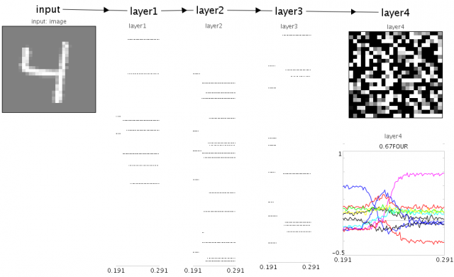

RBM deep belief network for visual digit recognition
====================================================

A spiking neuron model for digit recognition, created by training an
RBM Deep Belief Network on the MNIST database, then converting the
resulting model to spiking neurons via Nengo.

## Instructions

1. Run Nengo. You may need to increase the amount of memory available
   to Nengo by changing the command line option `-Xmx800m` to
   `-Xmx1600m` (in the script `nengo` or `nengo.bat`).
2. Run `digit.py`. After a while the interactive mode display will
   automatically appear.
3. Press play to start the model running. Digits will be shown at
   random to the network as input (on the left). The final output (on
   the right) is compared to the ideal semantic pointer for each digit
   (lower right). The sparse spiking behaviour of the intermediate
   layer neurons is shown in the middle.

## Figures

